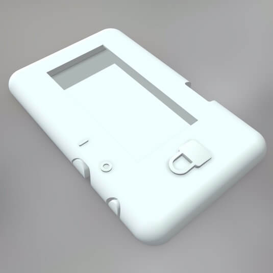

# VPN Remote Control Gadget

> Make it easy to be more private on the internet and remote control the VPN settings on your ASUS RT-AC68U router.

This project creates a remote control from the Arduino-programmed LilyGo TTGO T5 V2.3 ESP32 e-paper microcontroller 
board and a custom-designed 3D-printed case.

## Getting Started

Here is what you will need to build this project yourself:
- ASUS RT-AC68U router, configured to use a VPN of your choice
- LilyGo TTGO T5 V2.3 board
- USB charger and/or small LiPo battery (look for model number 301525)

### Programming the TTGO T5

You can find the Arduino sketch in the [vpn_remote_control_gadget](./arduino/vpn_remote_control_gadget) directory. 

1. Copy this directory into your Arduino sketch directory.
2. Follow the instructions in the 
   [LilyGo repository](https://github.com/Xinyuan-LilyGO/LilyGo-T5-ink-series/tree/acffc2fce8a6d504aa812ce1f9745281bd57a4bc)
   to install Arduino libraries for the TTGO T5 V2.3 board.
3. Install the following Arduino libraries via the Arduino library manager:
   - [ArduinoHttpClient](https://github.com/arduino-libraries/ArduinoHttpClient/tree/7f36561e0bced5458516066ae09636e119cae0ed)
   - [rBASE64](https://github.com/boseji/rBASE64/tree/a127f41eea31d2de7abc91cff4b2d1f4521625ec)
   - [ArduinoJson](https://arduinojson.org/)
   - [StringSplitter](https://github.com/aharshac/StringSplitter/tree/faef239fcea57055ba7bddc35d4a6c47bc05a9b4)
4. Modify the credentials in file [credentials_template.h](./arduino/vpn_remote_control_gadget/credentials_template.h) 
   and rename the file to `credentials.h`.
5. Upload the sketch to the board!

### Printing the Case

Send the file [vpn_control_gadget_assembly_manuf.obj](./cad/manufacturing/vpn_remote_control_gadget_assembly_manuf.obj)
to a 3D printing place of your choice. The case is designed so it can be printed through SLS with PA 12 material and a
rough finish. An [vpn_control_gadget_assembly_manuf.stl](./cad/manufacturing/vpn_remote_control_gadget_assembly_manuf.stl)
file is also available, should your printing place not like `.obj` files.

## Using the Gadget

To select a new VPN server or disconnect from the VPN, turn the TTGO T5 on using the slider on top of the case. Then,
select a VPN with the button next to the slider. Once the checkmark appears in the bottom right of the screen, the
request to change the VPN has been sent to the router. Now, you can turn off the gadget with the slider again. This 
helps to save battery. 

Thanks to the e-paper display your choice will remain visible even when the device powers off.

## Code Overview

The code on the Arduino talks to the ASUS router via POST requests. This is just like how the browser communicates with
the ASUS configuration page when you are logged into the router configuration in your browser.

The code was only tested with RT-AC68U firmware version 3.0.0.4.385_20633. If you use a different firmware, this code
may not longer work without adjustments.

All icons in the UI except for the arrow have been downloaded from [flaticon.com](https://www.flaticon.com) and 
converted to an Arduino-readable file format via the [LCD Image Converter](https://lcd-image-converter.riuson.com).

## CAD Overview

If you want to modify the case, you can find all CAD design files in the [cad/design](./cad/design) directory. You can
open and edit the files in [FreeCAD](https://www.freecadweb.org/). The files were created in FreeCAD version 0.19-22492.

### Mechanical Features

**Lid:** The case has a sliding lid on the back through which the microcontroller board can be inserted and removed. 
The lid is held in place by a pin. The pin unlocks when the lid is bent outward.

**Buttons:** The case has interfaces to 2 of TTGO T5's buttons. The lid features a cover for the button that is 
connected to channel IO39. The cover is connected to the case by a living hinge, avoiding any additional assembly. 
The case also provides an interface for the board's on/off slider. The slider is a removable part of the assembly, 
but stays in place thanks to a groove in the case's body once the board is assembled.

### Assembly Notes

With the case, the TTGO T5 can be either used with a USB connection alone, or with a small LiPo battery. There is space 
for a 80 mAh battery in the case (search for model number 301525).

There are 6 cylindrical support pins that help the assembly stay in placing during printing. After printing, you need 
to remove the 3 pins to separate the model into its 3 parts. If printed with PA 12, these pins should be easy to cut 
with scissors, a knife, or simply bending until they break. To make sure all components slide and fit neatly, you should
 grind down any leftovers of the pins.

Once all components are separated, push the on/off slider component onto the on/off switch, insert the board into to 
case, and slide the lid shut.

Optionally, the case can be mounted on surfaces by means of double-sided tape.

## Contributing

For questions or feedback, please file an issue here on GitHub. Feel free to open pull requests for any changes you 
think the project could benefit from.

## Credits

Code:
 - Used LilyGO [starter sketch](https://github.com/Xinyuan-LilyGO/LilyGo-T5-ink-series/blob/acffc2fce8a6d504aa812ce1f9745281bd57a4bc/LilyGo_T5_V2.3/LilyGo_T5_V2.3.ino) as a basis for communicating with e-paper display
 - WiFi Error icon, WiFi icon, VPN, and tick icon made by [Freepik](https://www.flaticon.com/authors/freepik) from [www.flaticon.com](https://www.flaticon.com/)
 - Hourglass icon made by [Kiranshastry](https://www.flaticon.com/free-icon/hourglass_709705?term=hourglass&page=1&position=18&related_item_id=709705) from [www.flaticon.com](https://www.flaticon.com/)

CAD:
 - The eye illustration on the back of the lid is part of Samuel Jessurun de Mesquita's print 
   "Zelfportret van alleen de ogen" (public domain, see [here](http://hdl.handle.net/10934/RM0001.COLLECT.209046)).

## License

This project is published under the [MIT License](./LICENSE.md).
